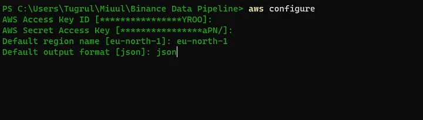
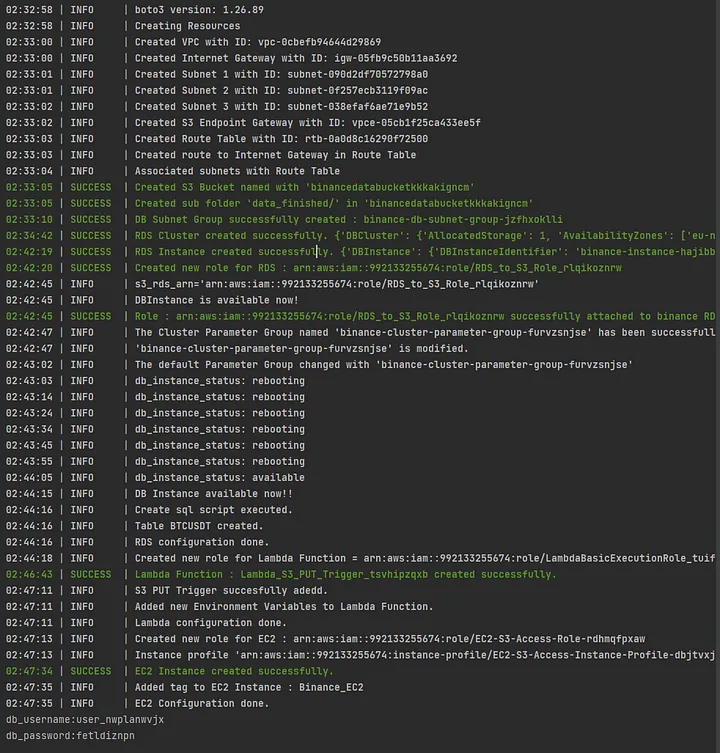

# BinanceDataPipelineInAWS


This repository contains the source code and instructions for setting up a Binance data pipeline in AWS using Boto3. The data pipeline automates the process of pulling data from Binance's API and processing it using AWS services. The pipeline consists of the following components:

* An S3 bucket to store the raw data.
* An EC2 instance to run the data ingestion script (**Python**).
* A Lambda function to process the data and store it in an RDS database.

The data ingestion script is written in Python and uses Boto3 to pull data from Binance's API and store it in the S3 bucket. 

## Getting Started
To get started the project, follow these steps:
* Clone this repository to your local machine.
* Install necessary libraries using these command :

        pip install -r requirements.txt
* Before using Boto3, we need to make sure that Amazon CLI has installed it on our system.
    * To download and install the Amazon CLI you will need to follow these steps:
      1. Visit the official AWS website at [Amazon CLI Install Guide](https://docs.aws.amazon.com/cli/latest/userguide/getting-started-install.html) and start the download by following the instructions appropriate for the operating system.
      2. After the installation is complete, open a command prompt and enter the command ```aws --version``` to verify that the Amazon CLI is installed correctly.
      3. Next, you will need to configure the Amazon CLI with your AWS credentials and region. You can do this by running the ```aws configure``` command and following the prompts.




* If everything is ready so far, we can run the script.


     python start_all_pipeline.py




## Boto3 Automate Script Instructions

Boto3 python script includes these steps respectively:

1. **VPC**
    * Create VPC.
    * Create Internet Gateway.
    * Create subnets.
    * Create route table.
      * Associate route tables.
    * Create VPC Endpoint Gateway S3.
    * Create tags.
2. **S3 Bucket**
    * Create new S3 Bucket.
    * Creating a subfolder with the name  ```data_finished/```
3. **RDS** 
    * Create new security group.
    * Add 63306 port(**Aurora MySQL RDS port**) to the New Security Group.
    * Create new subnet group for RDS.
    * Create RDS cluster.
    * Create Database Instance in RDS Cluster.
    * Create IAM Role and attach to RDS.
    * Create new parameter group.
    * Modify new parameter group with IAM Role ARN. (aurora_load_from_s3_role, aurora_select_into_s3_role, aws_default_s3_role)
    * Connect RDS and Create Binance Table.
4. **Lambda**
    * Create Lambda Function on VPC.
    * Add a new layer using ```python.zip```(***_mysql-connector library_***)
    * Create **S3 PUT Trigger**.
    * Add mysql connection informations to the Lambda Environment Variables.
5. **EC2**
    * Create IAM Role(***_S3FullAccess_***) and Instance Profile.
    * Create Instance.

## Links
For more detailed instructions, please visit [my medium article](https://medium.com/dev-genius/stream-binance-data-ingestion-in-aws-automating-the-entire-data-pipeline-with-boto3-d84933419aae) I wrote about project details.
